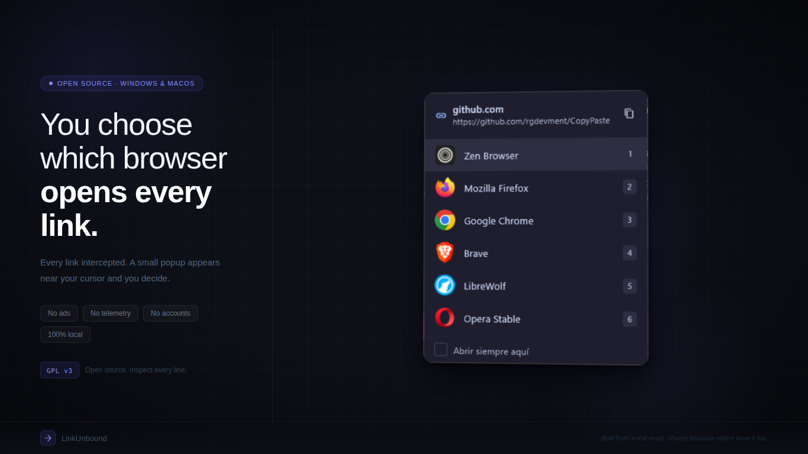
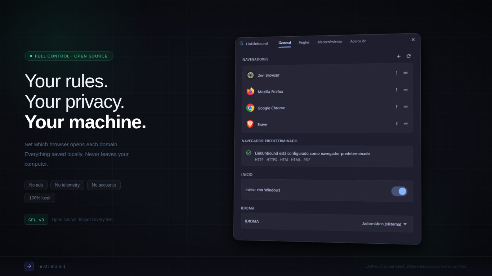

<div align="center">


# LinkUnbound

**A free, open source browser picker for Windows and macOS. Choose which browser opens every link.**

**Open source. Local-first. Privacy-first. Zero telemetry.**

<p>
  <a href="https://github.com/rgdevment/LinkUnbound/actions/workflows/ci.yml">
    
  </a>
  <a href="https://sonarcloud.io/summary/overall?id=rgdevment_LinkUnbound">
    
  </a>
  <a href="https://codecov.io/gh/rgdevment/LinkUnbound">
    
  </a>
  <a href="https://github.com/rgdevment/LinkUnbound/releases">
    
  </a>
  
  
  <a href="#license">
    
  </a>
  <a href="https://buymeacoffee.com/rgdevment">
    
  </a>
</p>

<p>
  
  &nbsp;
  
</p>

<h4>Download LinkUnbound</h4>

<p align="center">
  <a href="https://apps.microsoft.com/detail/9N9F7C8Q43KC">
    
  </a>
  &nbsp;
  <a href="#getting-started">
    
  </a>
</p>

<p align="center">
  <a href="https://github.com/rgdevment/LinkUnbound/releases">
    
  </a>
  &nbsp;
  <a href="https://github.com/rgdevment/LinkUnbound/releases">
    
  </a>
</p>

<p align="center">
  <sub>Prefer a direct download? <a href="https://github.com/rgdevment/LinkUnbound/releases/latest">GitHub Releases</a> has standalone installers — Windows (.exe) · macOS (.dmg)</sub>
</p>

</div>

---

**LinkUnbound** is a free, open source **browser picker**, **browser chooser** and **default browser manager** for Windows and macOS. Every link you click — in Teams, Outlook, Slack, Discord, a PDF, an email client, wherever — gets intercepted. If there's a domain rule, the assigned browser opens instantly. If not, a small **browser selection popup** appears next to your cursor so you can pick the right browser for that link.

Think of it as a lightweight **link router** / **URL router** and **browser switcher** that sits between your operating system and your browsers. Perfect for separating **work and personal browsing**, routing client domains to specific browser profiles, or handling multiple browsers without changing the system default every time.

This isn't a company product or a startup. I'm a solo developer who got tired of the OS deciding which browser opens a link, built this for myself, and decided to share it with the community. **No ads, no telemetry, no analytics, no accounts, no subscriptions, no cloud, no data collection.** Just a small native tool that lives on your machine and nowhere else.

---

## Table of Contents

- [What It Does](#what-it-does)
- [What It Is / What It Isn't](#what-it-is--what-it-isnt)
- [Privacy and Security](#privacy-and-security)
- [Getting Started](#getting-started)
- [How It Works](#how-it-works)
- [Domain Rules](#domain-rules)
- [Architecture](#architecture)
- [FAQ](#faq)
- [Localization](#localization)
- [Want to Help?](#want-to-help)
- [Support the Project](#support-the-project)
- [Other Tools](#other-tools)
- [License](#license)

---

## What It Does

- **Registers as default browser** — intercepts every link click system-wide on Windows and macOS
- **Shows a floating picker** near your cursor to choose a browser
- **Saves per-domain rules** — "always open this domain in X"
- **Resolves redirects** and Microsoft SafeLinks before matching rules
- **Runs silently** in the system tray (or menu bar on macOS) — launches on startup, stays out of the way
- **Detects installed browsers** automatically — or add custom ones manually
- **Supports multiple languages** — English and Spanish, with automatic detection

---

## What It Is / What It Isn't

**LinkUnbound is:**

- A **local-first browser picker** and **default browser manager** for Windows and macOS
- A lightweight **browser switcher** and **browser selector** that works offline
- An **open source** tool you can trust — GPL v3, inspect every line, fork it, contribute

**LinkUnbound is not:**

- A browser, toolbar, or extension
- A telemetry or analytics tool
- A "platform" with accounts, subscriptions, or ads
- A corporate product — it's a personal project shared with the community

---

## Privacy and Security

**Everything stays local.** LinkUnbound is built on a single, non-negotiable principle: your data never leaves your computer.

- **Local-only storage** — browser list, domain rules, and logs stay on your machine
- **URL redaction** — URLs are automatically redacted in logs at write time; the log file never contains actual URLs
- **No tracking** — no telemetry, no analytics, no hidden collection
- **No accounts** — no sign-up, no login, no profiles
- **One network request** — a read-only check against GitHub Releases API for updates (no user data sent, works offline)

**By design, LinkUnbound will never have:** accounts, subscriptions, ads, cloud sync, or data collection of any kind.

For responsible disclosure and security contact info, see [SECURITY.md](SECURITY.md). Full privacy details in [PRIVACY.md](PRIVACY.md).

---

## Getting Started

### Requirements

- Windows 10 or 11, **or** macOS 13 (Ventura) or newer
- At least two browsers installed

### Installation

**Windows — Microsoft Store** (recommended): [Get it from Microsoft Store](https://apps.microsoft.com/detail/9N9F7C8Q43KC) — one click, auto-updates, no security warnings.

**Windows — standalone installer**: download from [GitHub Releases](https://github.com/rgdevment/LinkUnbound/releases/latest).

**macOS** — install via Homebrew (signed and notarized):

```bash
brew tap rgdevment/tap
brew install --cask linkunbound          # stable
brew install --cask linkunbound-beta     # pre-release
```

Or download the `.dmg` directly from [GitHub Releases](https://github.com/rgdevment/LinkUnbound/releases/latest).

<details>
<summary><strong>Windows standalone: security warnings</strong></summary>

Since LinkUnbound is an independent open source project, the installer uses a self-signed certificate. Windows and your browser may show security warnings — this is normal and expected.

- **Browser:** Chrome/Edge may block the download — click Keep or Keep anyway.
- **SmartScreen:** Click More info → Run anyway (only happens once).
- **Why?** Code signing certificates cost $200–800/year. The code is 100% open source — you can inspect every line.

</details>

### Setup

**Windows:**

1. Run `linkunbound.exe`
2. On first launch, LinkUnbound scans your installed browsers and registers itself
3. In the settings window, click **Set as default** — Windows Settings opens, select LinkUnbound
4. Done — every link now goes through LinkUnbound

**macOS:**

1. Launch **LinkUnbound** from Applications (or Spotlight)
2. Open **Settings** from the menu bar icon → click **Set as default**
3. macOS prompts you to choose the default browser → select LinkUnbound
4. Done — every link now goes through LinkUnbound

---

## How It Works

**Link click with a rule:** browser opens instantly, no UI shown.

**Link click without a rule:** a picker appears near your cursor. Pick a browser. Optionally check "Always open here" to save a rule for that subdomain.

**Settings (tray):** double-click the tray icon or right-click → Settings. Four tabs:

- **General** — browsers, default browser status, startup toggle, language
- **Rules** — all domain rules, change browser per rule, delete rules
- **About** — version, license, update notifications, support links
- **Maintenance** — export diagnostics, reset configuration, unregister

---

## Domain Rules

Rules match hierarchically. A rule for `google.com` covers `mail.google.com`, `drive.google.com`, etc., unless a more specific subdomain rule exists.

Rules are created from the picker ("Always open here") and managed in the Rules tab.

---

## Architecture

One binary, two modes:

- `linkunbound` (no args) → settings + tray/menu bar (resident process)
- `linkunbound "https://..."` (link click) → routes the URL to the resident process and exits, or operates standalone

**Windows.** A named pipe (`\\.\pipe\LinkUnbound`) links second instances to the resident process. A Windows mutex prevents duplicate residents. Default-browser registration goes through `IApplicationAssociationRegistration`.

**macOS.** Single-instance launching is handled by Launch Services; URLs arrive through `application:openURLs:` (Apple Events) which are forwarded to Dart via a `MethodChannel`. Default-browser registration uses `LSSetDefaultHandlerForURLScheme`. The app runs as `LSUIElement` so it lives in the menu bar instead of the Dock.

---

## FAQ

**Is LinkUnbound free?**
Yes. Completely free and open source. No premium tiers, no subscriptions, no paywalls — ever.

**Does it track my browsing?**
No. LinkUnbound does not track or transmit anything. URLs are processed in memory and automatically redacted before being written to the navigation log — the log file never contains actual URLs, only privacy-safe placeholders.

**Does it need internet?**
No. LinkUnbound works fully offline. The only network request is a lightweight update check against the GitHub Releases API — no user data sent. The app works perfectly without a connection.

**Where is my data stored?**
Everything stays on your machine — `%LOCALAPPDATA%\LinkUnbound\` on Windows, `~/Library/Application Support/LinkUnbound/` on macOS. Browser list (`browsers.json`), domain rules (`rules.json`), navigation log (`navigate.log`), and extracted icons.

**Does it work with any browser?**
Yes. LinkUnbound detects all browsers registered with the operating system. You can also add custom browsers manually with any executable path and arguments.

**Can I use it with Microsoft SafeLinks?**
Yes. LinkUnbound resolves SafeLinks and other redirect wrappers before matching domain rules, so your rules work on the actual destination URL.

---

## Localization

LinkUnbound supports English and Spanish with automatic language detection. You can override the language in Settings.

| Language | Tag   | Status   |
| :------- | :---: | :------: |
| English  | en    | Complete |
| Spanish  | es    | Complete |

Want to add your language? See the [translation guide](CONTRIBUTING.md#adding-a-translation) in CONTRIBUTING.md.

---

## Want to Help?

Contributions are always appreciated:

- **Write Code** — Fix bugs or add features. See [CONTRIBUTING.md](CONTRIBUTING.md).
- **Translate** — Add your language.
- **Report Bugs** — [Open an issue](https://github.com/rgdevment/LinkUnbound/issues/new).
- **Share Ideas** — Tell me what you wish this browser picker could do.

---

## Support the Project

LinkUnbound is free and will always be free. No ads, no premium tiers, no paywalls. If it saves you time and you want to support continued development, you can buy me a coffee:

<p align="center">
  <a href="https://buymeacoffee.com/rgdevment">
    
  </a>
</p>

Every contribution helps keep these tools alive and maintained. But if you can't or don't want to donate — that's completely fine. Star the repo, share it with someone, or just use it. That's enough.

---

## Other Tools

I build free, open source tools focused on privacy and productivity. If you like LinkUnbound, you might also find these useful:

- **[CopyPaste](https://github.com/rgdevment/CopyPaste)** — A local-first clipboard manager and clipboard history tool for Windows, macOS, and Linux. Same philosophy: no ads, no telemetry, no accounts. Everything local.

---

## License

**LinkUnbound** — A free, open source browser picker for Windows and macOS.
Copyright (C) 2026 Mario Hidalgo G. (rgdevment)

This program comes with ABSOLUTELY NO WARRANTY.
This is free software, and you are welcome to redistribute it under certain conditions.
Distributed under the **GNU General Public License v3.0**. See [LICENSE](LICENSE) for details.

---

I built LinkUnbound because I was tired of my OS not letting me choose which browser opens a link. This is a personal tool, built from a real need, shared because others might need it too. Free to use, free to inspect, free forever.

<sub>**Keywords:** browser picker, browser chooser, default browser manager, browser switcher, link router, URL router, link handler, multi-browser workflow, open source browser picker Windows, browser picker macOS, Microsoft Store browser picker, privacy-first link handler, local-first browser routing, no telemetry, work and personal browser separation, Teams links browser, Outlook links browser, Slack links browser, SafeLinks resolver, Browserosaurus alternative, Choosy alternative, BrowserPick alternative.</sub>
